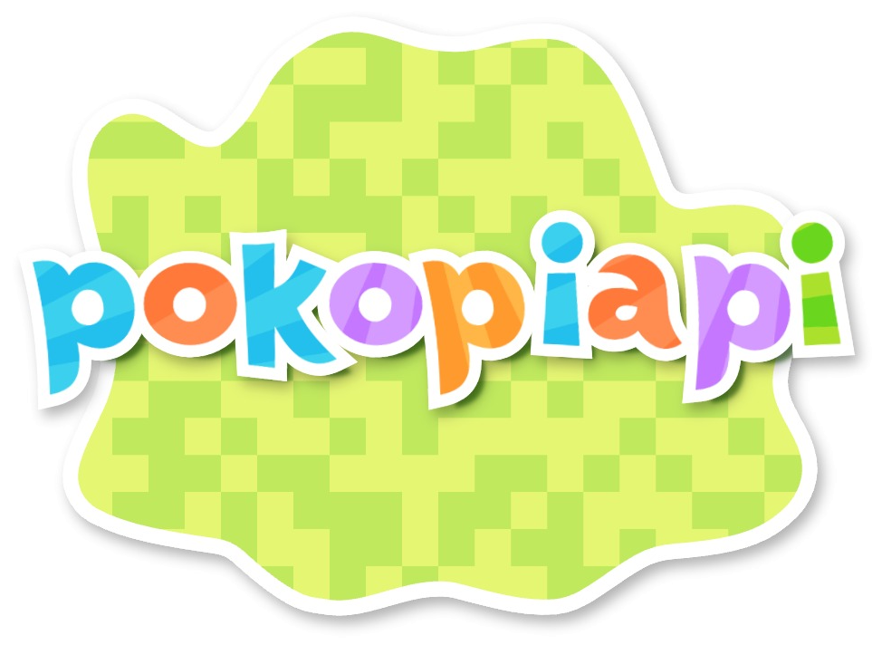

# Pokopia API

<div align="center">
  
</div>

Pokopia API provides structured Pokémon Pokopia data through a Fastify REST API. The data snapshot includes the regular Pokédex, Event Pokédex through E007, and Bubbly Basin content available on August 17, 2026.

## Quick start

```bash
npm install
npm run dev
```

The API is served under `/api/v1`. Pokémon and item endpoints support pagination, search, content-source filters, event filters, and data-completeness metadata.

## Content model

| Field           | Purpose                                                             |
| --------------- | ------------------------------------------------------------------- |
| `dex`           | Distinguishes regular, Event, and Basin Pokédex entries.            |
| `contentSource` | Distinguishes base, free-update, event, and expansion-pass content. |
| `release`       | Records a verified patch and release date when known.               |
| `availability`  | Records permanent, annual, limited, or unknown availability.        |
| `provenance`    | Identifies the official or community source behind the record.      |
| `dataStatus`    | Marks records as verified, partial, or unverified.                  |
| `unknownFields` | Names fields intentionally left unknown instead of inferred.        |
| `recipeStatus`  | Distinguishes verified, incomplete, and absent recipes.             |

Existing response fields remain present and unchanged for the original dataset. New records use `null` or empty arrays when no reliable value or image URL is available.

## August 2026 snapshot

- 365 Pokémon: 308 regular, 7 Event, and 50 Basin entries.
- Frillish and Jellicent expose verified male and female forms without duplicating their Pokédex entries.
- 1,767 items: 46 Event items (23 newly cataloged and 23 migrated in place) and 219 Bubbly Basin items.
- The seven Event Pokémon belong to four events; the 46 Event items belong to seven events.
- 142 named Basin recipe rows: 127 verified and 15 incomplete from the available source snapshot.
- 36 Bubbly Basin habitats and the Scrub specialty assignments documented by the community source.

## Free update and paid DLC

The free software update adds Dive. Bubbly Basin itself belongs to the paid Pokémon Pokopia Expansion Pass Part 1. Do not classify every underwater feature as paid content.

Official references:

- https://pokopia.pokemon.com/en-us/update/
- https://pokopia.pokemon.com/en-us/expansion/
- https://www.nintendo.com/us/whatsnew/pokemon-pokopia-expansion-pass-paid-dlc-keep-the-cozy-life-going-with-a-brand-new-underwater-area/

## Source limitations

The official pages confirm the product boundary, release context, and purchase bonuses, but do not publish exhaustive data tables. Pokémon, habitats, items, recipes, specialties, and event schedules therefore use dated Bulbapedia snapshots:

- https://bulbapedia.bulbagarden.net/w/index.php?title=List_of_Pok%C3%A9mon_by_Pok%C3%A9dex_(Basin)_number_in_Pok%C3%A9mon_Pokopia&oldid=4609372
- https://bulbapedia.bulbagarden.net/w/index.php?title=List_of_Pok%C3%A9mon_by_Pok%C3%A9dex_(Event)_number_in_Pok%C3%A9mon_Pokopia&oldid=4609373
- https://bulbapedia.bulbagarden.net/w/index.php?title=Habitat_Dex_(Basin)&oldid=4613172
- https://bulbapedia.bulbagarden.net/w/index.php?title=List_of_Basin_items_in_Pok%C3%A9mon_Pokopia&oldid=4613812
- https://bulbapedia.bulbagarden.net/w/index.php?title=List_of_Basin_recipes_in_Pok%C3%A9mon_Pokopia&oldid=4613810
- https://bulbapedia.bulbagarden.net/w/index.php?title=List_of_event_items_in_Pok%C3%A9mon_Pokopia&oldid=4611985
- https://bulbapedia.bulbagarden.net/w/index.php?title=Scrub_(specialty)&oldid=4613413

Nintendo's August 5, 2026 announcement confirms the Bubbly Basin release date. It identifies version 2.0.0 as the free update required for Dive, not as a version number for the DLC data itself, so Basin records leave `release.patch` unknown.

The Basin item and recipe revisions are explicitly marked incomplete. Fifteen cataloged recipes still lack complete source data, and unlisted recipes or fields remain unavailable. New Event and Basin images remain `null` unless a repository-hosted image already existed. English item names are preserved in Spanish responses where no verified Spanish game localization was available. Basin connectivity requirements remain unknown: official sources only require internet for purchase-bonus redemption, not for using Basin itself. Official pages are live documents and cannot be revision-frozen; every community provenance URL is pinned to the revision verified on August 17, 2026.

## Stack

- Node.js 22
- Fastify 5
- TypeScript
- Zod
- Cloudflare R2

## License

BSD-3-Clause
